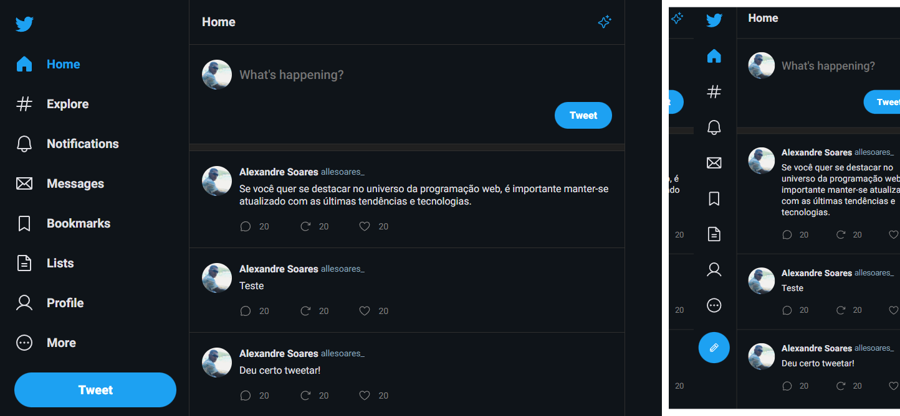

<div align="center">
  <h1>Masterclasser React</h1>
</div>

<div>
  
</div>

## Criação de clone do Twitter Reponsivo
[Acesse o Projeto](https://project-twt.vercel.app/)
---

## Sobre:
<div> 
  <h3>
    Esse projeto foi criado no curso de Masterclasser de React pela @rocketseat.<br>
    Construindo uma aplicação completa utilizando React e as principais ferramentas que fazem parte do universo dessa tecnologia.<br>
    Aprendendo os fundamentos, conhecendo as estruturas do projeto e aplicando TypeScript no React.
    Nesse projeto você podera tweetar e comentar em tweets existentes.
  </h3>
</div>
<br>

---

## Instalação do projeto no seu computador e rodar aplicação

<h3>Requisitos: NodeJS </h3>

```
terminal:

# clone o repositório do github.
$ git clone https://github.com/allesoares95/project-twt

# acessar a pasta do projeto pelo terminal.
$ cd project-twt

# instalação das dependências.
$ npm i

# rodar aplicação web.
$ npm run dev

# aplicação será aberta no http://localhost:5173
```

---

## Ferramentas e Bibliotecas utilizadas:

```
Icons: phosphor-react
https://github.com/phosphor-icons/homepage

React router dom
https://reactrouter.com/en/main

ElectronJS
https://www.electronjs.org/pt/

```


<!-- 
Fluxo de renderização:
1. Toda vez que alteramos o estado de um componente, TODO componente é recalculado.
2. Toda vez que o seu componente PAI renderizar.
3. Toda vez que alguma das suas propriedades mudarem.

Algoritmo de reconciliação:
1. Criar em memória a nova versão do HTML do componente
2. Compara essa nova versão com a versão anterior do HTML (Diff)
3. Aplicar as operações JavaScript para alterar somente o necessário no HTML 
-->
